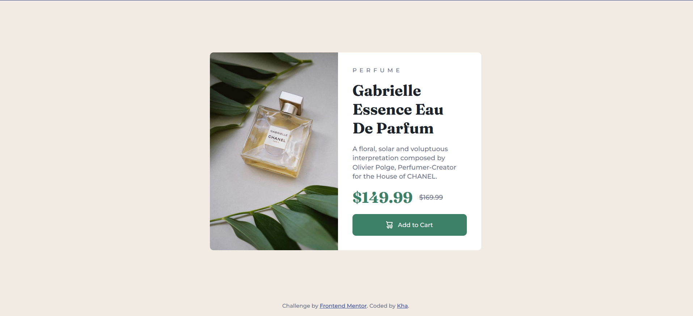

## Table of contents

  - [The challenge](#the-challenge)
  - [Screenshot](#screenshot)
  - [Built with](#built-with)
  - [Author](#author)

### The challenge

Users should be able to:

- View the optimal layout depending on their device's screen size
- See hover and focus states for interactive elements

### Screenshot

### Links

- Challenge: [Product preview card component]([https://your-live-site-url.com](https://www.frontendmentor.io/challenges/product-preview-card-component-GO7UmttRfa))

- Solution: [My solution]([https://your-solution-url.com](https://minhkha27.github.io/product-preview-card-component-main/))

### Built with

- Semantic HTML5 markup
- CSS custom properties
- Flexbox

## Author
- Code by Kha :frog:
- Frontend Mentor - [:frog:]([https://www.frontendmentor.io/profile/yourusername](https://www.frontendmentor.io/profile/MinhKha27))
